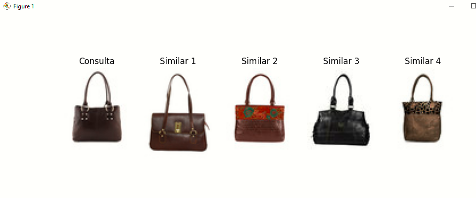

# Image-Based-Product-Recommender

Descrição do Projeto:

Este projeto implementa um sistema de recomendação baseado em similaridade visual de imagens de produtos. A ideia é que, dado um produto em forma de imagem, o sistema recomende outros produtos similares considerando apenas características visuais — como cor, formato e textura — sem usar dados textuais como marca, preço ou modelo.

Trata-se de uma aplicação prática de visão computacional com técnicas de aprendizado profundo (Deep Learning), focada em extrair e comparar embeddings de imagens para gerar recomendações visuais precisas.

Objetivo:

Construir um modelo capaz de extrair recursos visuais relevantes das imagens usando uma rede neural pré-treinada (ResNet50).

Implementar um sistema de busca por similaridade usando esses recursos.

Gerar recomendações de produtos que sejam visualmente semelhantes ao produto consultado.

Criar uma aplicação escalável para suportar grandes volumes de dados visuais.

## 🖼️ Exemplo de Resultado

Abaixo está um exemplo da recomendação visual gerada pelo sistema:

Ferramentas e Tecnologias Utilizadas:

Linguagem: Python

Bibliotecas de Deep Learning: TensorFlow, Keras

Manipulação e visualização de dados: NumPy, Pandas, Matplotlib, Pillow (PIL), tqdm

Visão Computacional: OpenCV

Modelos pré-treinados: ResNet50 (para extração de embeddings)

Indexação e Similaridade:

scikit-learn (k-Nearest Neighbors)

FAISS (Facebook AI Similarity Search) para buscas rápidas em grandes volumes

Gerenciamento de dados: Kaggle API (para baixar datasets)

Instruções importantes:

Para baixar os datasets do Kaggle, é necessário criar uma conta no Kaggle
, gerar sua chave da API (arquivo kaggle.json) e configurá-la localmente para autenticação.

O arquivo kaggle.json deve ser mantido seguro e não enviado ao repositório público.

Resultados Esperados

Sistema capaz de recomendar produtos visualmente semelhantes a partir de uma imagem de entrada.

Visualização dos produtos recomendados com alta similaridade visual.

Facilidade de expansão do sistema para mais categorias e maior quantidade de dados.

Aprendizados Adquiridos:

Compreensão prática de técnicas de extração de características visuais usando redes neurais pré-treinadas.

Familiaridade com o processamento e pré-processamento de imagens para visão computacional.

Implementação e uso de algoritmos eficientes de busca por similaridade em espaços vetoriais (k-NN e FAISS).

Integração de diferentes bibliotecas para criar um pipeline completo de recomendação visual.

Conhecimento sobre boas práticas para gerenciar datasets externos e APIs, como a do Kaggle.

Como usar:

Configure sua chave do Kaggle (kaggle.json).

Baixe e organize o dataset.

Execute o script para extrair embeddings das imagens.

Utilize o sistema de recomendação para encontrar produtos similares.

